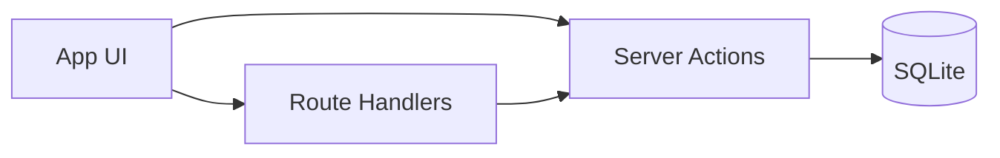

# Architecture

## Tech stack

- **Framework:** React 19 with Next.js 15+ (App Router)
- **Language:** TypeScript (strict mode)
- **Styling:** Tailwind CSS v4 (`@theme` in CSS, no `tailwind.config.js`)
- **UI:** shadcn/ui (Slate grayscale), Lucide React icons
- **State:** Zustand (global UI, e.g. sidebar collapse)
- **Forms & validation:** React Hook Form, Zod, `@hookform/resolvers/zod`
- **Data:** SQLite via Drizzle ORM (`better-sqlite3`), drizzle-kit for migrations

## Project structure

```
src/
  app/           # Next.js App Router: routes, layout, API
  components/    # React components (layout, ui, feature)
  db/            # Drizzle schema, client, seed
  actions/       # Server Actions (blips, feed)
  lib/           # Shared utilities, Zod schemas
  stores/        # Zustand stores
  test/          # Vitest setup
```

## High-level flow



- **Server Actions** handle mutations (create/update/delete blip, snooze, fizzle) and are called from client components. They run on the server and use the Drizzle client; they revalidate paths after changes.
- **Route Handlers** (e.g. `GET /api/feed`) provide a clear API boundary for the feed; they call the same feed logic as the server-rendered Feed page.
- **Database** is SQLite (file); only server code (Actions, Route Handlers, Server Components) touches the DB. No direct DB access from the client.

## Domains

- **Blips:** Core entity; capture, feed, detail, snooze, fizzle, categories.
- **Categories:** List and filter; “Uncategorized” for `categoryId = null`.
- **Feed:** Resurfacing list (due or null `nextReviewAt`, active status, optional category filter).
- **Settings:** Theme (next-themes), profile placeholder (Phase 1).

## Key files

| Area       | Path / file                                               |
| ---------- | --------------------------------------------------------- |
| Schema     | `src/db/schema.ts`                                        |
| DB client  | `src/db/index.ts`                                         |
| Validation | `src/lib/validations.ts`                                  |
| Blip logic | `src/actions/blips.ts`                                    |
| Feed API   | `src/app/api/feed/route.ts`                               |
| Layout     | `src/app/layout.tsx`, `src/components/layout/Sidebar.tsx` |
