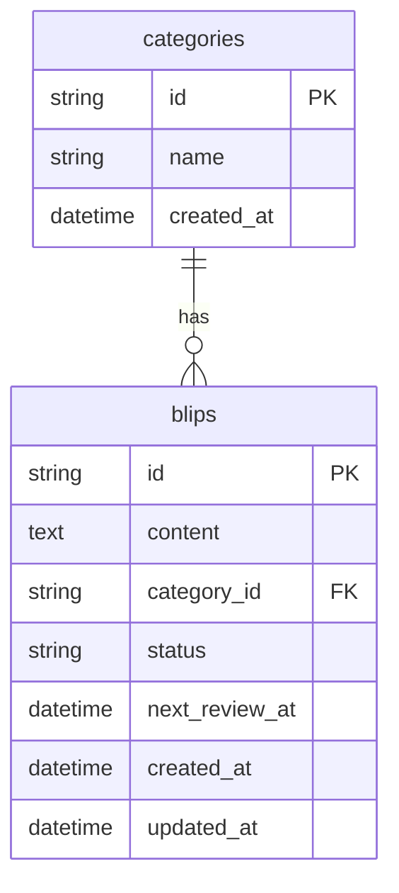

# Data model

Phase 1 uses two tables. The canonical schema is in `src/db/schema.ts` (Drizzle).

## Tables

### categories

| Column     | Type    | Constraints | Description                      |
| ---------- | ------- | ----------- | -------------------------------- |
| id         | text    | PK          | Unique id (e.g. `uncategorized`) |
| name       | text    | NOT NULL    | Display name                     |
| created_at | integer | NOT NULL    | Timestamp (mode: timestamp)      |

- One row represents “Uncategorized” (id `uncategorized`); other categories are user-defined later.

### blips

| Column         | Type    | Constraints                  | Description                                    |
| -------------- | ------- | ---------------------------- | ---------------------------------------------- |
| id             | text    | PK                           | UUID                                           |
| content        | text    | NOT NULL                     | Blip body                                      |
| category_id    | text    | nullable, FK → categories.id | Category or null (uncategorized)               |
| status         | text    | NOT NULL, default `active`   | `active` \| `matured` \| `fizzled`             |
| next_review_at | integer | nullable                     | Timestamp (mode: timestamp); when to resurface |
| created_at     | integer | NOT NULL                     | Timestamp                                      |
| updated_at     | integer | NOT NULL                     | Timestamp                                      |

- **status:** `active` = in feed/cultivation; `matured` = graduated; `fizzled` = terminal, no longer shown in feed.
- **next_review_at:** Used for feed: “due” when `next_review_at <= today` or null. Snooze sets this to a future date.

## Relationships

- **categories → blips:** One category has many blips (`category_id` FK). Blips with `category_id IS NULL` are “Uncategorized”.

## ER (conceptual)

## Migrations

- Generated with: `npm run db:generate`
- Applied with: `npm run db:migrate`
- Seed (e.g. Uncategorized): `npm run db:seed`
